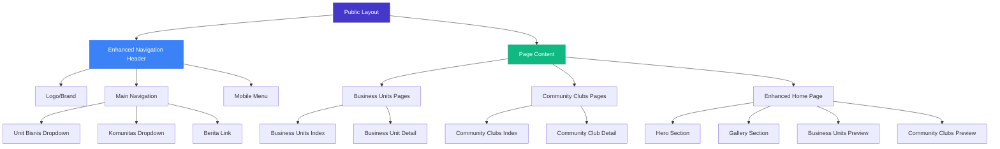
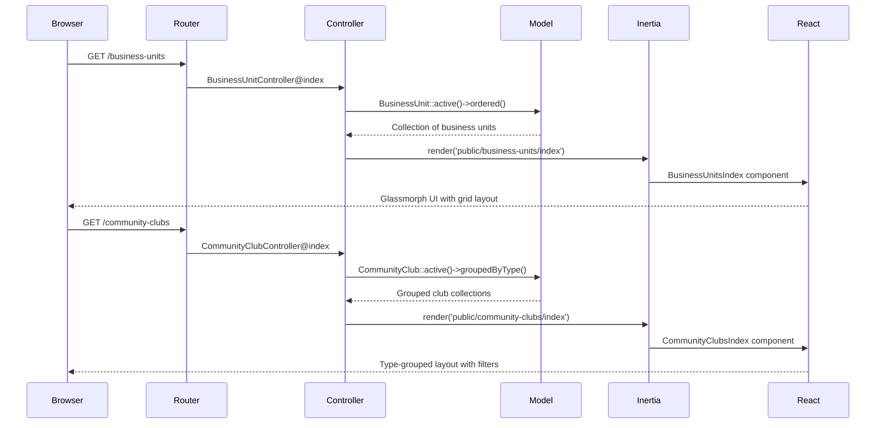

# Business Community Public Pages Design

## Overview

This design outlines the implementation of public-facing pages for Unit Bisnis (Business Units) and Komunitas (Community Clubs) with modern glassmorph visual effects, enhanced navigation with dropdown menus, and an integrated gallery section on the home page. The implementation leverages the existing Laravel-Inertia-React architecture while introducing contemporary UI/UX patterns.

## Technology Stack & Dependencies

### Existing Stack
- **Backend**: Laravel 12.0 with Inertia.js integration
- **Frontend**: React 19.0.0 with TypeScript 5.7.2
- **Styling**: Tailwind CSS 4.0.0
- **Build Tool**: Vite 7.0.4

### Additional Dependencies Required
- **UI Components**: Existing Radix UI components (@radix-ui/react-dropdown-menu)
- **Icons**: Lucide React (already available)
- **Styling**: Enhanced Tailwind utilities for glassmorph effects

## Architecture

### Component Hierarchy



### Data Flow Architecture



## Component Architecture

### Enhanced Navigation Component

**Location**: `resources/js/components/public-header.tsx`

#### Component Structure
```tsx
interface PublicHeaderProps {
    businessUnits: BusinessUnit[];
    communityClubs: CommunityClub[];
    clubTypes: string[];
}
```

#### Navigation Menu Implementation
- **Dropdown Triggers**: Business Units and Community Clubs
- **Mega Menu Style**: Grid layout showcasing items with images
- **Mobile Responsive**: Collapsible hamburger menu
- **Glassmorph Effects**: Backdrop blur with semi-transparent backgrounds

### Business Units Pages

#### Index Page Component
**Location**: `resources/js/pages/public/business-units/index.tsx`

**Features**:
- Masonry grid layout with glassmorph cards
- Filter by services offered
- Search functionality
- Animated hover effects with scaling
- Contact information display

#### Detail Page Component
**Location**: `resources/js/pages/public/business-units/show.tsx`

**Sections**:
- Hero banner with glassmorph overlay
- Services grid with icons
- Contact information panel
- Operating hours display
- Related business units carousel

### Community Clubs Pages

#### Index Page Component
**Location**: `resources/js/pages/public/community-clubs/index.tsx`

**Features**:
- Type-based filtering tabs
- Activity tags display
- Meeting schedule indicators
- Member count display (if available)
- Join/Contact buttons

#### Detail Page Component
**Location**: `resources/js/pages/public/community-clubs/show.tsx`

**Sections**:
- Club overview with glassmorph design
- Activities timeline
- Meeting information
- Contact person details
- Photo gallery integration

### Enhanced Home Page

#### Gallery Section Implementation
**Location**: Enhanced `resources/js/pages/home.tsx`

**New Gallery Features**:
- Selected media from media manager
- Lightbox functionality
- Masonry layout
- Lazy loading
- Touch/swipe gestures for mobile

### Styling Strategy

#### Glassmorph Design System

**CSS Utilities**:
```css
/* Glassmorph base classes */
.glass-card {
  @apply backdrop-blur-md bg-white/10 border border-white/20 rounded-xl shadow-xl;
}

.glass-header {
  @apply backdrop-blur-lg bg-white/5 border-b border-white/10;
}

.glass-overlay {
  @apply backdrop-blur-sm bg-gradient-to-r from-black/30 to-transparent;
}
```

**Color Scheme**:
- Primary: Indigo gradient (existing)
- Secondary: Purple accent
- Glass effects: White with opacity variations
- Dark mode: Adapted with darker glass effects

#### Responsive Breakpoints
- Mobile: 0-640px
- Tablet: 641-1024px  
- Desktop: 1025px+

## API Endpoints Reference

### Business Units Endpoints

| Method | Endpoint | Controller Action | Purpose |
|--------|----------|-------------------|---------|
| GET | `/business-units` | `BusinessUnitController@index` | List all active business units |
| GET | `/business-units/{slug}` | `BusinessUnitController@show` | Show business unit details |

### Community Clubs Endpoints

| Method | Endpoint | Controller Action | Purpose |
|--------|----------|-------------------|---------|
| GET | `/community-clubs` | `CommunityClubController@index` | List all active clubs grouped by type |
| GET | `/community-clubs/{slug}` | `CommunityClubController@show` | Show club details |

### Navigation Data Endpoint

| Method | Endpoint | Controller Action | Purpose |
|--------|----------|-------------------|---------|
| GET | `/api/navigation-data` | `NavigationController@data` | Fetch navigation dropdown data |

## Data Models & ORM Mapping

### Business Unit Model Enhancements

**Existing Model**: `app/Models/BusinessUnit.php`

**Additional Scopes**:
```php
public function scopeActive($query) {
    return $query->where('is_active', true);
}

public function scopeOrdered($query) {
    return $query->orderBy('sort_order')->orderBy('name');
}

public function scopeWithMedia($query) {
    return $query->whereNotNull('image');
}
```

### Community Club Model Enhancements

**Existing Model**: `app/Models/CommunityClub.php`

**Additional Relationships**:
```php
public function getActivitiesArrayAttribute() {
    return json_decode($this->activities, true) ?? [];
}

public static function getTypes() {
    return self::active()->distinct()->pluck('type')->filter()->values();
}
```

### Media Integration

**Gallery Data Structure**:
```php
// Controller method to fetch gallery media
public function getGalleryMedia() {
    return Media::whereIn('id', GlobalVariable::where('key', 'home_gallery_ids')
        ->value('value') ? json_decode(GlobalVariable::where('key', 'home_gallery_ids')
        ->value('value')) : [])
        ->orderBy('created_at', 'desc')
        ->get();
}
```

## Routing & Navigation System

### Route Definitions

**File**: `routes/web.php`

```php
// Public routes
Route::get('/business-units', [BusinessUnitController::class, 'index'])
    ->name('business-units.index');
Route::get('/business-units/{businessUnit:slug}', [BusinessUnitController::class, 'show'])
    ->name('business-units.show');

Route::get('/community-clubs', [CommunityClubController::class, 'index'])
    ->name('community-clubs.index');
Route::get('/community-clubs/{communityClub:slug}', [CommunityClubController::class, 'show'])
    ->name('community-clubs.show');

// Navigation API
Route::get('/api/navigation-data', [NavigationController::class, 'data'])
    ->name('api.navigation-data');
```

### Navigation State Management

**Global Navigation State**:
- Dropdown open/close states
- Mobile menu toggle
- Active route highlighting
- Scroll-based header behavior

## Testing Strategy

### Component Testing

**Framework**: Jest with React Testing Library

**Test Categories**:
1. **Navigation Component Tests**
   - Dropdown functionality
   - Mobile menu behavior
   - Link navigation verification

2. **Page Component Tests**
   - Data rendering verification
   - Filter functionality
   - Responsive behavior

3. **Glassmorph Effects Tests**
   - CSS class application
   - Visual regression testing

### Integration Testing

**Framework**: Laravel Feature Tests

**Test Scenarios**:
1. **Route Testing**
   - Public route accessibility
   - Slug-based routing
   - Data passing verification

2. **Controller Testing**
   - Active data filtering
   - Grouped data structure
   - Error handling

### Visual Testing

**Tools**: Storybook for component showcase

**Components to Test**:
- Navigation dropdowns
- Glassmorph cards
- Gallery lightbox
- Mobile responsive layouts