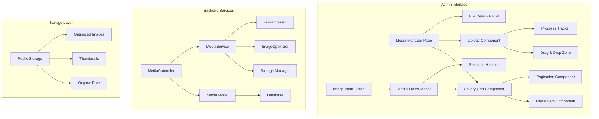
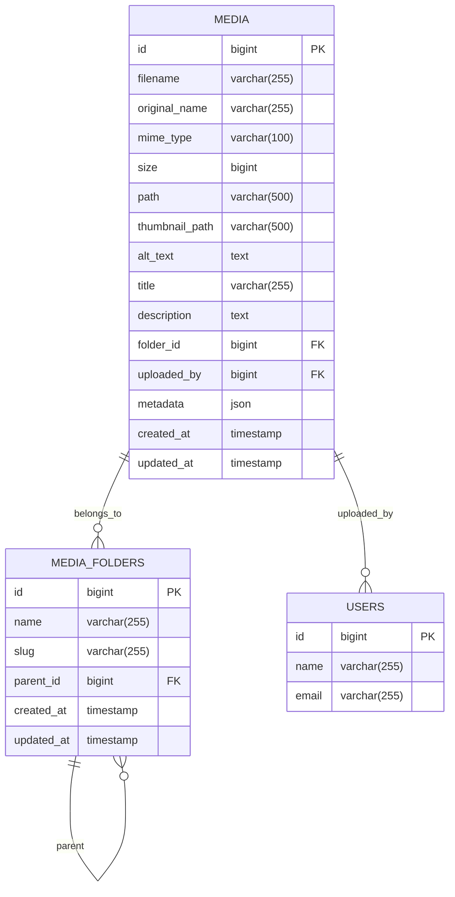
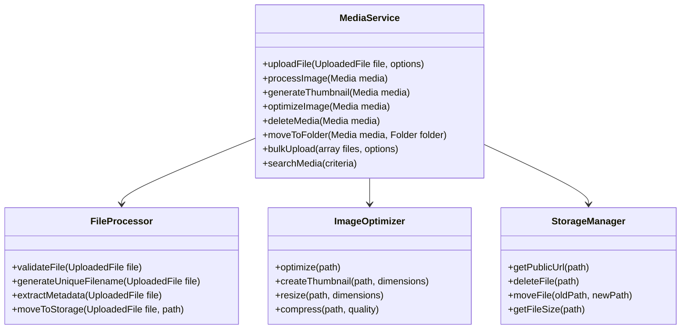
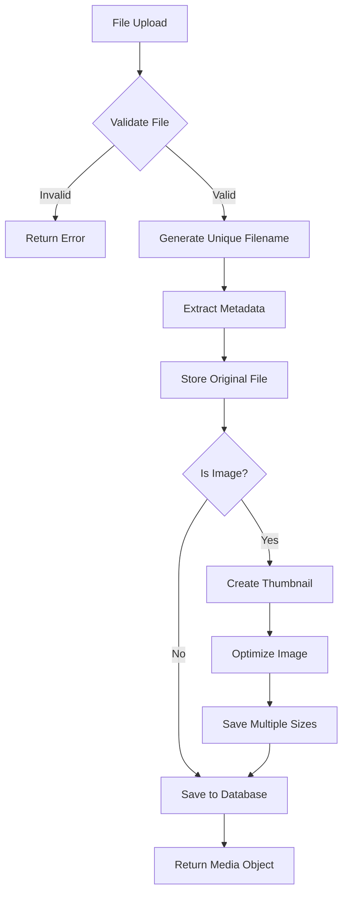
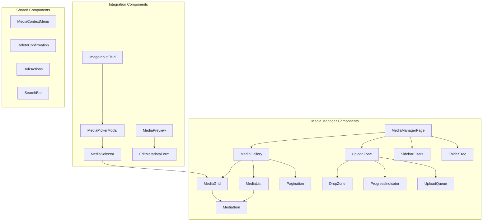
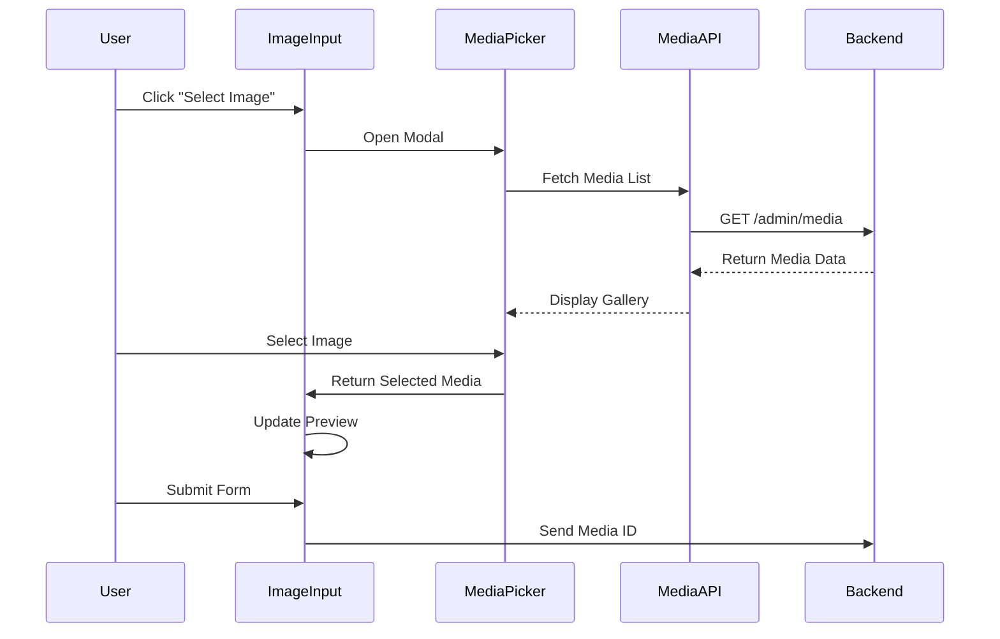
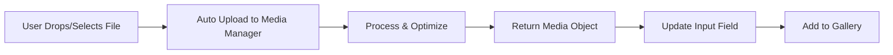

# Media Manager System Design

## Overview

The Media Manager is a comprehensive file management system designed for the admin interface of the cigi-global Laravel application. It provides a centralized gallery for managing images, with seamless integration into existing forms and content management workflows. The system allows administrators to upload, organize, and select images from a unified interface while automatically integrating with any image input field throughout the admin panel.

## Technology Stack & Dependencies

### Backend Components
- **Laravel 12** - Core framework with file storage capabilities
- **Intervention Image** - Image processing and optimization
- **Laravel File Manager** - Enhanced file handling
- **Spatie Image Optimizer** - Automatic image optimization

### Frontend Components  
- **React 19** - UI components and state management
- **Inertia.js v2** - Seamless backend-frontend integration
- **TypeScript** - Type safety and developer experience
- **Tailwind CSS v4** - Styling and responsive design
- **React DnD** - Drag and drop functionality
- **React Virtualized** - Performance optimization for large galleries

## Architecture

### Component Architecture



### Data Models & Database Schema

#### Media Model



#### Database Migration Structure

**Media Table**
- `id` - Primary key
- `filename` - Generated unique filename
- `original_name` - Original uploaded filename
- `mime_type` - File MIME type (image/jpeg, image/png, etc.)
- `size` - File size in bytes
- `path` - Storage path to main file
- `thumbnail_path` - Storage path to thumbnail
- `alt_text` - Accessibility description
- `title` - Display title
- `description` - Optional description
- `folder_id` - Foreign key to folders table
- `uploaded_by` - Foreign key to users table
- `metadata` - JSON field for EXIF data, dimensions, etc.
- `created_at` / `updated_at` - Timestamps

**Media Folders Table**
- `id` - Primary key  
- `name` - Folder display name
- `slug` - URL-friendly folder identifier
- `parent_id` - Self-referencing foreign key for nested folders
- `created_at` / `updated_at` - Timestamps

### API Endpoints Reference

#### Media Management Endpoints

| Method | Endpoint | Description | Request Body | Response |
|--------|----------|-------------|--------------|----------|
| GET | `/admin/media` | List media with pagination/filtering | Query params: page, folder_id, search, type | Paginated media collection |
| POST | `/admin/media/upload` | Upload single/multiple files | FormData with files[] | Upload results with media objects |
| GET | `/admin/media/{id}` | Get media details | - | Media object with metadata |
| PUT | `/admin/media/{id}` | Update media metadata | title, alt_text, description, folder_id | Updated media object |
| DELETE | `/admin/media/{id}` | Delete media file | - | Success confirmation |
| GET | `/admin/media/folders` | List all folders | - | Nested folder structure |
| POST | `/admin/media/folders` | Create new folder | name, parent_id | Created folder object |
| PUT | `/admin/media/folders/{id}` | Update folder | name, parent_id | Updated folder object |
| DELETE | `/admin/media/folders/{id}` | Delete folder | - | Success confirmation |

#### Integration Endpoints

| Method | Endpoint | Description | Response |
|--------|----------|-------------|----------|
| GET | `/admin/media/picker` | Media picker modal data | Media collection with folders |
| POST | `/admin/media/bulk-upload` | Bulk upload with folder assignment | Upload results |
| GET | `/admin/media/search` | Search media by filename/metadata | Filtered media results |

### Business Logic Layer

#### MediaService Architecture



#### File Processing Workflow



### Frontend Component Architecture

#### Core Components Structure



#### Component Specifications

**MediaGallery Component**
- Props: `media[]`, `selectedItems[]`, `onSelect()`, `viewMode`, `loading`
- State: Selection management, view preferences
- Features: Grid/list toggle, infinite scroll, keyboard navigation

**MediaItem Component**  
- Props: `media`, `selected`, `onSelect()`, `onDoubleClick()`, `size`
- State: Hover effects, loading states
- Features: Lazy loading, context menu, preview on hover

**UploadZone Component**
- Props: `onUpload()`, `acceptedTypes[]`, `maxSize`, `multiple`
- State: Drag state, upload progress, error handling
- Features: Drag & drop, paste support, progress tracking

**MediaPickerModal Component**
- Props: `isOpen`, `onSelect()`, `onClose()`, `multiple`, `filter`
- State: Search, folder navigation, selection
- Features: Search, filtering, folder browsing, selection

### Integration with Existing Forms

#### Enhanced Image Input Fields



#### Auto-Upload Integration



### Storage Strategy

#### File Organization Structure

```
storage/app/public/media/
├── originals/
│   ├── 2024/
│   │   ├── 01/
│   │   │   ├── filename-hash.jpg
│   │   │   └── ...
│   │   └── 02/
│   └── 2023/
├── thumbnails/
│   ├── 150x150/
│   ├── 300x300/
│   └── 600x400/
└── optimized/
    ├── small/    # 800px width
    ├── medium/   # 1200px width
    └── large/    # 1920px width
```

#### Image Processing Pipeline

**Thumbnail Generation**
- Small: 150x150px (admin grid)
- Medium: 300x300px (modal preview)  
- Large: 600x400px (detail view)

**Responsive Variants**
- Small: 800px width (mobile)
- Medium: 1200px width (tablet)
- Large: 1920px width (desktop)

**Optimization Settings**
- JPEG: 85% quality
- PNG: Lossless compression
- WebP: Auto-generation for modern browsers

### Testing Strategy

#### Unit Testing Requirements

**Backend Tests**
- `MediaServiceTest` - File upload, processing, deletion
- `FileProcessorTest` - Validation, metadata extraction
- `ImageOptimizerTest` - Thumbnail generation, optimization
- `MediaControllerTest` - API endpoint responses
- `MediaModelTest` - Relationships, scopes, mutators

**Frontend Tests**
- `MediaGallery.test.tsx` - Rendering, selection, pagination
- `UploadZone.test.tsx` - File handling, progress tracking
- `MediaPicker.test.tsx` - Modal behavior, selection logic
- `ImageInput.test.tsx` - Integration with media picker

#### Feature Testing Scenarios

**Upload Flow Tests**
- Single file upload
- Multiple file upload
- Drag & drop functionality
- Upload progress tracking
- Error handling for invalid files
- File size limit enforcement

**Gallery Management Tests**
- Media listing and pagination
- Search and filtering
- Folder organization
- Bulk operations
- Delete confirmation
- Metadata editing

**Integration Tests**
- News article image selection
- Business unit logo upload
- Community club banner assignment
- Global variable image management

#### Performance Testing

**Load Testing Scenarios**
- Large gallery rendering (1000+ items)
- Bulk upload performance (50+ files)
- Concurrent user uploads
- Search performance with large datasets
- Image optimization processing time

**Browser Compatibility**
- Chrome, Firefox, Safari, Edge
- Mobile responsive design
- Touch interface support
- Keyboard navigation accessibility